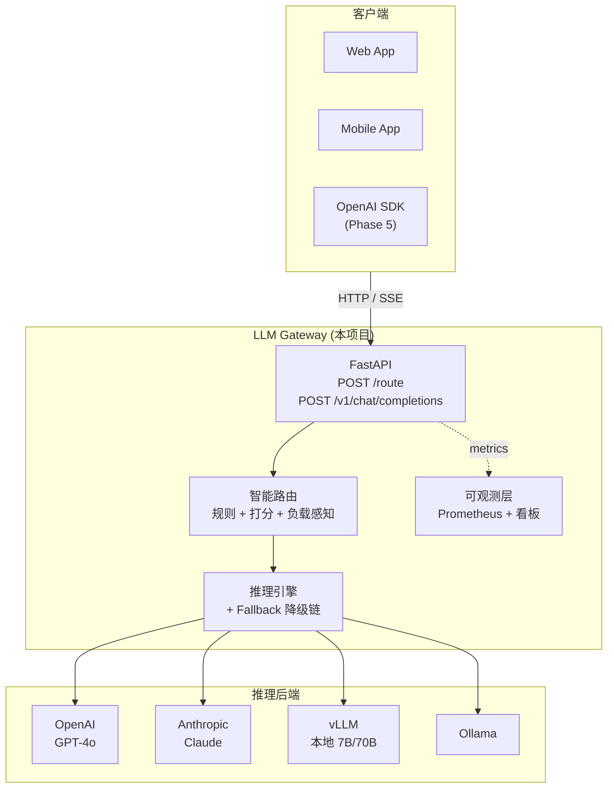

# LLM Router & Execution Platform

> 一个面向多模型时代的 **LLM Gateway**：把一个用户请求自动路由到最合适的大模型（OpenAI / Anthropic / vLLM / Ollama）去执行，并管好成本、速度、容错、可观测。

类比定位：你可以理解为一个**简化版 [LiteLLM](https://github.com/BerriAI/litellm) / [Portkey](https://portkey.ai) / [Helicone](https://helicone.ai)**。

---

## 📌 项目要解决的真实痛点

业界但凡同时在用多个大模型（GPT-4o / Claude / 本地 Llama）的团队，都需要这样一层 Gateway：

| 痛点 | Gateway 怎么解 |
|---|---|
| 用 GPT-4o 回答"今天天气" → 账单爆炸 | 简单 query 路由到便宜的小模型 |
| OpenAI 抽风一次 → 整个产品 500 | 自动 fallback 到 Anthropic / 本地 |
| 业务方 N 个服务硬编码模型名 | 业务只调 `/route`，后端随便换 |
| 不知道 LLM 花了多少钱、慢在哪 | 实时按用户/模型归因成本 + P95 延迟 |
| 想做模型 A/B 实验 | 改一行配置即可切流量 |

---

## 🎯 项目路线图 (5 Phases)

| Phase | 主题 | 关键能力 | 状态 |
|---|---|---|---|
| **Phase 1** | 主链路打通 | FastAPI + Pydantic + 规则路由 + Mock Provider + 单测 | ✅ **已完成** |
| **Phase 2** | 智能路由 + 容错 | 配置驱动规则 (AST 安全表达式) + 多 Provider + Fallback 降级链 | 🚧 进行中 |
| **Phase 3** | 可观测看板 | Streamlit 多页看板：QPS / P95 / SLO / 成本归因 | ⏳ |
| **Phase 4** | 真实推理 + 推理可观测 | vLLM / Ollama 接入 + SSE 流式 + TTFT/TPOT + Prometheus + 负载感知调度 | ⏳ |
| **Phase 5** | 生产形态外壳 | OpenAI 兼容协议 + Streamlit Chat 调试台 + 真后端验收 | ⏳ |

详细设计文档：[Phase 1](./Phase%201/Phase%201.md) · [Phase 2](./Phase%202/Phase%202.md) · [Phase 3](./Phase%203/Phase%203.md) · [Phase 4](./Phase%204/Phase%204.md) · [Phase 5](./Phase%205/Phase%205.md)

---

## 🏗 架构总览



---

## 🚀 Quick Start (Phase 1)

### 前置

- Python 3.10+
- [uv](https://docs.astral.sh/uv/) (推荐) 或 pip

### 启动服务

```bash
cd LLMRouter
uv venv
uv sync
uv run python main.py
```

服务启动在 `http://localhost:8081`。

### 试一下

```bash
# 健康检查
curl -s http://localhost:8081/health | python3 -m json.tool

# 普通问题 → 会选 general-small
curl -s http://localhost:8081/route \
  -H 'Content-Type: application/json' \
  -d '{"query":"hello","user_id":"u1","user_tier":"free"}' \
  | python3 -m json.tool

# 编程问题 → 会自动选 coding-pro
curl -s http://localhost:8081/route \
  -H 'Content-Type: application/json' \
  -d '{"query":"write a python function","user_id":"u1","user_tier":"free"}' \
  | python3 -m json.tool
```

### 接口文档

打开浏览器访问：[http://localhost:8081/docs](http://localhost:8081/docs)

### 跑测试

```bash
cd LLMRouter
uv run pytest -v
```

---

## 🧩 Phase 1 项目结构

```
LLMRouter/
├── main.py                    # 启动入口  (uv run python main.py)
├── config.yaml                # 配置驱动：模型清单、单价、路由规则
├── pyproject.toml             # uv 管理的依赖
├── app/
│   ├── main.py                # FastAPI 应用工厂
│   ├── schemas.py             # Pydantic 数据契约 (Wire / Internal / Config 三类)
│   ├── core/
│   │   └── config.py          # YAML → AppConfig (lru_cache 单例)
│   ├── services/
│   │   ├── router.py          # QueryRouter：规则路由
│   │   └── inference.py       # MockProvider + InferenceEngine
│   └── api/
│       └── routes.py          # GET /health, POST /route
└── tests/
    └── test_api.py            # 6 个 pytest smoke tests
```

### 设计原则

- **配置驱动**：模型、单价、路由规则全部从 `config.yaml` 读取，业务代码不写死
- **分层职责**：API 层只做"组装"，业务逻辑在 services，数据契约在 schemas
- **三类模型分离**：Wire (HTTP) / Internal (服务内) / Config (镜像 yaml) 互不污染
- **依赖注入**：QueryRouter / InferenceEngine 通过参数注入 config，方便测试
- **Fail Fast + 优雅降级**：检查不通过立刻报错；模型缺失时降到默认模型

---

## 🛠 技术栈

| 类别 | 技术 |
|---|---|
| 语言 | Python 3.10+ |
| Web | FastAPI · Uvicorn |
| 数据契约 | Pydantic v2 |
| 配置 | PyYAML · `@lru_cache` 单例 |
| 测试 | pytest · FastAPI TestClient |
| 包管理 | uv |
| 计划接入 (Phase 2-5) | vLLM · Ollama · OpenAI SDK · Streamlit · Prometheus |

---

## 📖 接口契约 (Phase 1)

### `POST /route`

**请求**:
```json
{
  "query": "write a python function to reverse a list",
  "user_id": "u1",
  "user_tier": "free"
}
```

**响应**:
```json
{
  "query_id": "f47ac10b-58cc-4372-...",
  "response": "Echo from coding-pro: write a python function to reverse a list",
  "model_name": "coding-pro",
  "tokens": { "input": 8, "output": 11, "total": 19 },
  "cost_usd": 0.00006,
  "latency_ms": 1,
  "cached": false,
  "routing": {
    "reason": "Detected coding-related keywords in the query.",
    "confidence": 0.82,
    "query_type": "coding"
  }
}
```

### 路由规则 (Phase 1 简化版)

按顺序判断：

1. `len(query) > 1000` → 走 `long-context`
2. 包含 `code` / `function` / `class` / `bug` / `python` 关键词 → 走 `coding-pro`
3. 其他 → 走 `default_model` (`general-small`)

Phase 2 会把这套硬编码规则替换成 **配置驱动的 AST 安全表达式** + **综合打分**。

---

## 📜 License

MIT

---

## 🙋 作者

[@YifanLi3](https://github.com/YifanLi3) · 学习项目，准备投递 AI Platform / LLM Infra 岗位。
