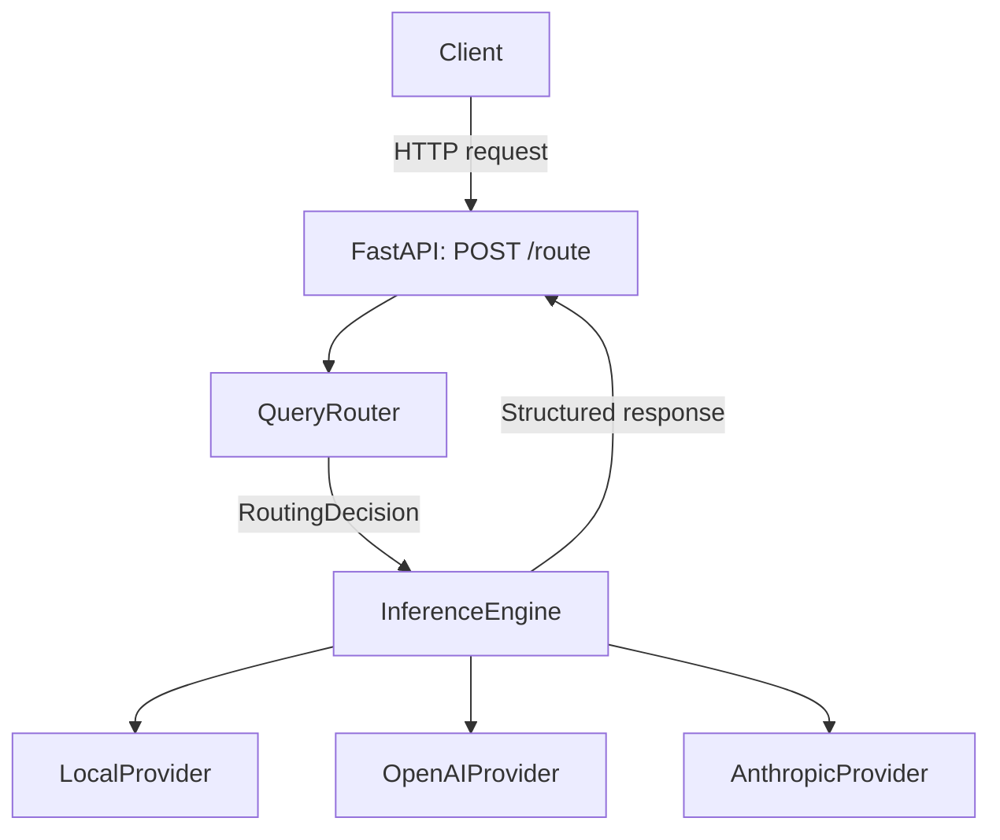

# LLM Router & Execution Platform

> An **LLM Gateway** for multi-model applications. It routes each request to an appropriate model backend and manages cost, latency, reliability, and observability.

Conceptually, this project is a simplified version of [LiteLLM](https://github.com/BerriAI/litellm), [Portkey](https://portkey.ai), or [Helicone](https://helicone.ai).

## The problem it solves

Teams using multiple model backends—such as GPT-4o, Claude, and local Llama deployments—need a gateway layer for consistent routing and failure handling.

| Problem | Gateway approach |
|---|---|
| Expensive models answer trivial questions | Route simple requests to lower-cost models |
| A provider outage causes application-wide failures | Retry a fallback model or provider |
| Many services hard-code model names | Applications call a single `/route` API |
| Cost and latency are difficult to attribute | Track them by request and selected model |
| Model A/B experiments require code changes | Change model and routing configuration |

## Roadmap

| Phase | Focus | Key capabilities | Status |
|---|---|---|---|
| **Phase 1** | Working request path | FastAPI, Pydantic, rule routing, mock inference, tests | ✅ Complete |
| **Phase 2** | Intelligent routing and resilience | Config rules, AST-safe expressions, provider abstraction, fallback | ✅ Complete |
| **Phase 3** | Observability dashboard | Streamlit pages, QPS, P95, SLOs, and cost attribution | ⏳ Planned |
| **Phase 4** | Real inference and inference observability | vLLM/Ollama, SSE, TTFT/TPOT, Prometheus, load-aware routing | ⏳ Planned |
| **Phase 5** | Production-facing interface | OpenAI-compatible API, Streamlit console, backend validation | ⏳ Planned |

Design documents: [Phase 1](./Phase%201/Phase%201.md) · [Phase 2](./Phase%202/Phase%202.md) · [Phase 3](./Phase%203/Phase%203.md) · [Phase 4](./Phase%204/Phase%204.md) · [Phase 5](./Phase%205/Phase%205.md)

## Architecture



## Quick start

### Prerequisites

- Python 3.10+
- [uv](https://docs.astral.sh/uv/)

### Start the service

```bash
cd LLMRouter
uv sync --group dev
uv run python main.py
```

The service listens at `http://localhost:8081`.

### Try it

```bash
# Health and configured-provider status
curl -s http://localhost:8081/health | python3 -m json.tool

# General request -> usually selects general-small
curl -s http://localhost:8081/route \
  -H 'Content-Type: application/json' \
  -d '{"query":"hello","user_id":"u1","user_tier":"free"}' \
  | python3 -m json.tool

# Coding request -> selects coding-pro
curl -s http://localhost:8081/route \
  -H 'Content-Type: application/json' \
  -d '{"query":"write a python function","user_id":"u1","user_tier":"free"}' \
  | python3 -m json.tool
```

Interactive API documentation: [http://localhost:8081/docs](http://localhost:8081/docs)

### Run the test suite

```bash
cd LLMRouter
uv run pytest -v
```

## Project structure

```text
LLMRouter/
├── main.py                    # Entry point: uv run python main.py
├── config.yaml                # Model registry, routing rules, and costs
├── pyproject.toml             # uv dependency configuration
├── app/
│   ├── main.py                # FastAPI application setup
│   ├── schemas.py             # Wire, internal, and configuration contracts
│   ├── core/
│   │   ├── config.py          # YAML -> AppConfig, cached per process
│   │   ├── logging.py         # Central logging configuration
│   │   └── rules.py           # AST-whitelisted rule evaluator
│   ├── providers/
│   │   ├── base.py            # BaseProvider interface
│   │   ├── local.py           # Deterministic local Echo provider
│   │   ├── openai.py          # OpenAI provider placeholder
│   │   └── anthropic.py       # Anthropic provider placeholder
│   ├── services/
│   │   ├── router.py          # Classification, filtering, and scoring
│   │   └── inference.py       # Provider dispatch and fallback execution
│   └── api/
│       └── routes.py          # GET /health and POST /route
└── tests/
    ├── test_api.py            # API integration tests
    ├── test_router.py         # Router tests
    ├── test_rules.py          # Safe AST evaluator tests
    └── test_inference.py      # Provider and fallback tests
```

### Design principles

- **Configuration-driven:** model metadata, prices, and routing rules come from `config.yaml`.
- **Layered responsibilities:** the API assembles responses; services hold business logic; schemas define contracts.
- **Separated schema lifetimes:** wire models cross HTTP boundaries, internal models move within the service, and config models mirror YAML.
- **Dependency injection:** `QueryRouter` and `InferenceEngine` receive their configuration explicitly for testability.
- **Graceful degradation:** a provider failure triggers configured fallbacks before the API returns a 503 response.

## Technology stack

| Category | Technology |
|---|---|
| Language | Python 3.10+ |
| API | FastAPI, Uvicorn |
| Data contracts | Pydantic v2 |
| Configuration | PyYAML, `@lru_cache` |
| Testing | pytest, FastAPI TestClient |
| Package management | uv |
| Planned integrations | vLLM, Ollama, OpenAI SDK, Streamlit, Prometheus |

## API contract

### `POST /route`

Request:

```json
{
  "query": "write a python function to reverse a list",
  "user_id": "u1",
  "user_tier": "free"
}
```

Response:

```json
{
  "query_id": "f47ac10b-58cc-4372-...",
  "response": "Echo from coding-pro: write a python function to reverse a list",
  "model_name": "coding-pro",
  "provider": "local",
  "tokens": { "input": 8, "output": 11, "total": 19 },
  "cost_usd": 0.00006,
  "latency_ms": 1,
  "cached": false,
  "routing": {
    "reason": "[rule=coding_route] scored 2 candidate(s); top=coding-pro (...)",
    "confidence": 0.82,
    "query_type": "coding",
    "matched_rule": "coding_route",
    "fallback_models": ["general-small"],
    "fallback_used": false,
    "attempted_models": ["coding-pro"],
    "provider_errors": {}
  }
}
```

## Phase 2 capabilities

- **Safe rule engine:** evaluates configuration expressions through an AST whitelist and rejects function calls, attribute access, and other unsafe syntax.
- **Intelligent selection:** filters and scores models by request type, user tier, cost limit, context capacity, capabilities, latency, success rate, and priority.
- **Provider abstraction:** `LocalProvider`, `OpenAIProvider`, and `AnthropicProvider` implement the same `BaseProvider` interface.
- **Executed fallback:** if a primary provider fails, `InferenceEngine` tries the router's fallback chain and returns attempts and error details.
- **Health reporting:** `GET /health` exposes router configuration, provider model lists, and provider availability. The service is `degraded` when external providers are unavailable but a local provider still works.
- **Structured logging:** run `LOG_LEVEL=DEBUG uv run python main.py` to inspect classification, rule matching, filtering, scoring, and execution.

### Routing rules

Rules are declared in `config.yaml` and checked in order. A matching rule narrows the candidate pool; otherwise, all models proceed through filtering and scoring.

```yaml
- name: coding_route
  condition: "query_type == 'coding'"
  candidates: [coding-pro, general-small]
  fallback: general-small
```

## License

MIT

## Author

[@YifanLi3](https://github.com/YifanLi3) · Learning project for AI Platform and LLM Infrastructure roles.
